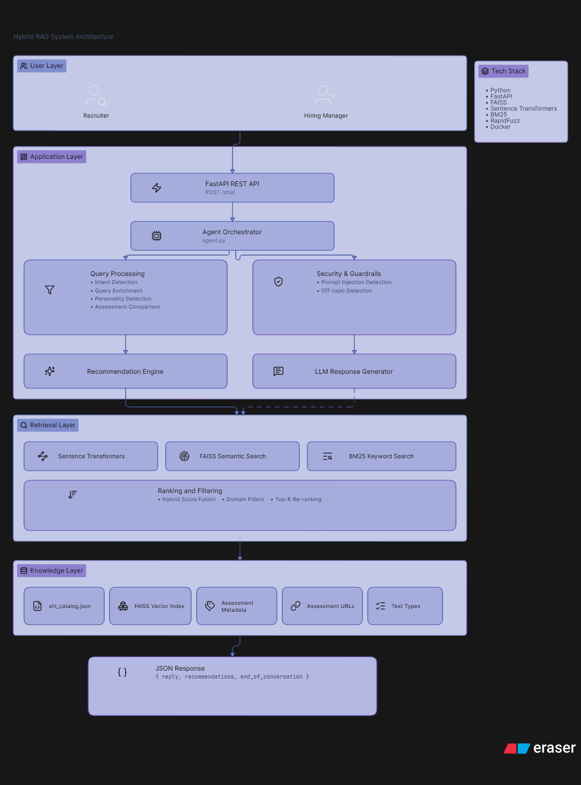
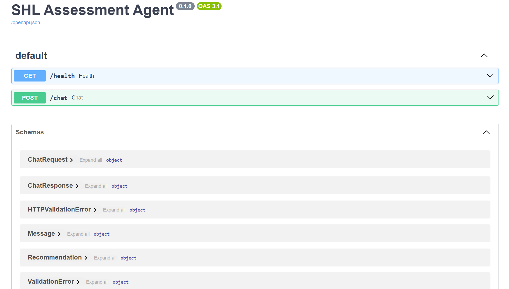
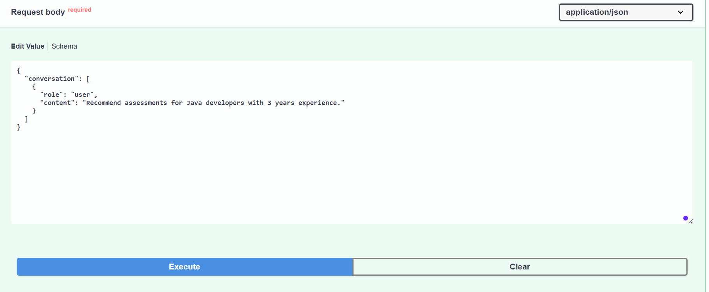
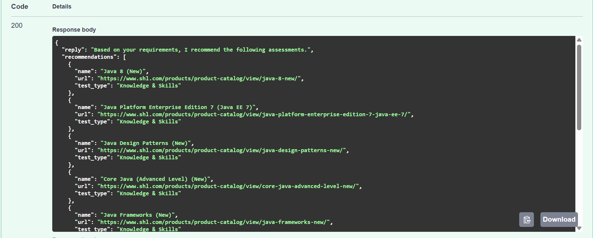
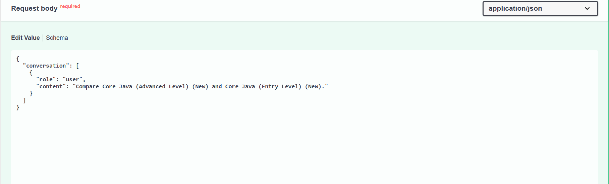
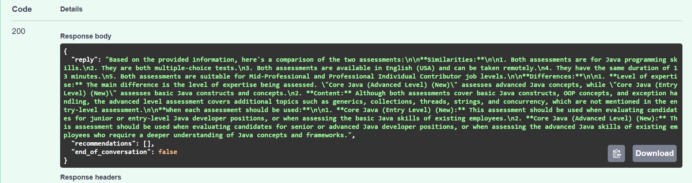
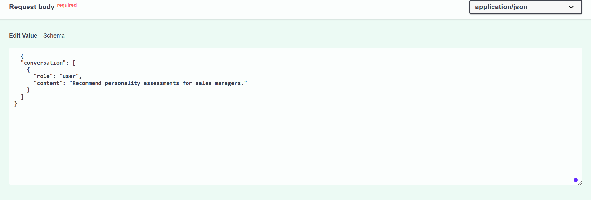
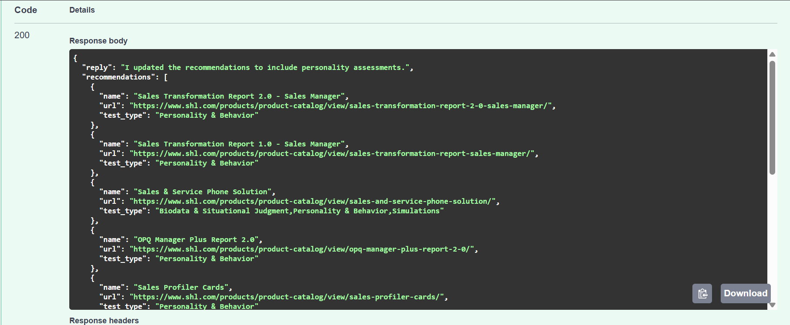
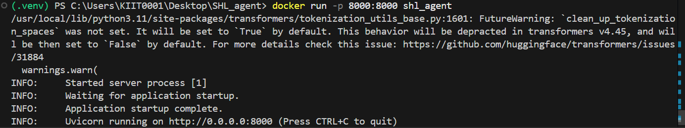

# SHL Assessment Recommendation Agent

A Hybrid Retrieval-Augmented Generation (RAG) system that recommends relevant SHL assessments based on user requirements, compares assessments, and supports conversational updates with personality assessment filtering.

---

# Features

- Hybrid Retrieval (Semantic Search + Keyword Search)
- FAISS Vector Search
- BM25 Keyword Search
- Assessment Recommendation Engine
- Assessment Comparison
- Personality Assessment Support
- Prompt Injection Protection
- Off-topic Detection
- Structured JSON Responses
- Dockerized Deployment

---

# Architecture



---

# Tech Stack

- Python
- FastAPI
- Sentence Transformers
- FAISS
- BM25
- RapidFuzz
- Docker
- Pydantic

---

# Project Structure

```text
SHL_agent/
│
├── app/
│   ├── agent.py
│   ├── retrieval.py
│   ├── reranker.py
│   ├── filters.py
│   ├── guardrails.py
│   ├── llm.py
│   ├── main.py
│   └── ...
│
├── data/
│   ├── shl_catalog.json
│   └── shl.index
│
├── docs/
│   ├── architecture.png
│   ├── swagger_home.png
│   ├── recommendation_request.png
│   ├── recommendation_response.png
│   ├── comparison_request.png
│   ├── comparison_response.png
│   ├── personality_request.png
│   ├── personality_response.png
│   └── docker_running.png
│
├── Dockerfile
├── docker-compose.yml
├── requirements.txt
├── README.md
└── .gitignore
```

---

# API Endpoint

## POST `/chat`

Accepts a conversation and returns recommendations or comparisons.

### Request Format

```json
{
  "conversation": [
    {
      "role": "user",
      "content": "Recommend Java assessments for software engineers."
    }
  ]
}
```

### Response Format

```json
{
  "reply": "Based on your requirements, I recommend the following assessments.",
  "recommendations": [
    {
      "name": "Java 8 (New)",
      "url": "https://www.shl.com/products/product-catalog/view/java-8-new/",
      "test_type": "Knowledge & Skills"
    }
  ],
  "end_of_conversation": false
}
```

---

# Example Use Cases

## Assessment Recommendation

```text
Recommend Java assessments for software engineers.
```

## Assessment Comparison

```text
Compare Core Java (Advanced Level) and Core Java (Entry Level).
```

## Personality Assessment Recommendation

```text
Recommend personality assessments for sales managers.
```

---

# API Screenshots

## Swagger UI



---

## Recommendation Request



---

## Recommendation Response



---

## Comparison Request



---

## Comparison Response



---

## Personality Assessment Request



---

## Personality Response



---

# Running Locally

## Clone Repository

```bash
git clone <repository-url>
cd SHL_agent
```

## Create Virtual Environment

```bash
python -m venv .venv
```

Activate:

### Windows

```bash
.venv\Scripts\activate
```

### Linux/Mac

```bash
source .venv/bin/activate
```

## Install Dependencies

```bash
pip install -r requirements.txt
```

## Start FastAPI Server

```bash
uvicorn app.main:app --reload
```

Open:

```text
http://localhost:8000/docs
```

---

# Docker Setup

## Build Docker Image

```bash
docker build -t shl_agent .
```

## Run Container

```bash
docker run -p 8000:8000 shl_agent
```

Open:

```text
http://localhost:8000/docs
```

---

# Docker Screenshot



---

# Key Components

### Query Processing
- Intent Detection
- Query Enrichment
- Personality Detection
- Assessment Comparison Detection

### Retrieval Engine
- Sentence Transformers Embeddings
- FAISS Semantic Search
- BM25 Keyword Search

### Ranking Layer
- Hybrid Score Fusion
- Domain Filters
- Personality Filtering
- Top-K Re-ranking

### Guardrails
- Prompt Injection Detection
- Off-topic Detection
- Domain Restriction

---

# Future Improvements

- Redis Caching
- Streaming Responses
- Multi-language Support
- Advanced Re-ranking Models
- Cloud Deployment (AWS/GCP)

---

# Author

Kshitij Vats

Built as part of the SHL Assessment Recommendation Agent assignment.